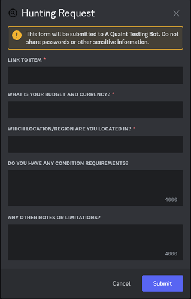
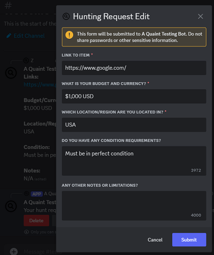
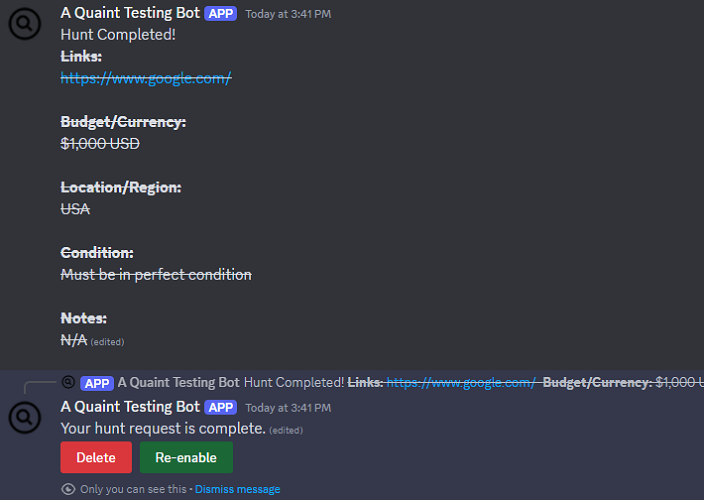

# Hunting Request Bot 

## General
This bot command will help facilitate users in search of specific objects from a server by giving them a workflow for easy management of the request. This command is restricted to specific channels (defined in-code).

This specific bot was designed with portability in mind, so the code is centralized to one file, [hunt.ts](./hunt-bot/hunt.ts), whereas normally it would be a bit more spread out.

## Workflow
Upon a user running the command `/hunt`, this bot will pop up a modal to the user. The modal will ask basic information from them to help facilitate others to understand what to search for.  

Once the user fills out the information, they can press submit, which will do two things. First it will make a public message to the channel where the request was made relaying the information from the modal. Second it will send a ephemeral message to the original person that made the request, which contains information on how they can manage the life-cylce of that request.

1. Delete: Will delete the request from view. This cannot be undone. 

2. Edit: Brings up a modal for the user to re-enter information regarding the request. After the user submits it, it will update the request and send an ephemeral message to the user letting them know it was updated.

3. Complete: Marks the request as complete, by ~~striking through~~ all of the content and making a note on top.
    

4. Re-enable: Resets the "complete" state of a request by removing the strike through and note on top. This effectively reverts it back to the initial reply. 

## Getting Started
Before this bot will work, ensure you have read the primary [README](../../README).
Additionally, this bot restricts itself to certain channels within the server. To ensure that this bot works in your server, edit the string array variable `HuntChannels` in [hunt.ts](./hunt-bot/hunt.ts)

### The Code 
For those familiar with Discord.js, this probably won't be very complicated. The main class, `Hunt`, has three properties: 
1. `Command`: Maps to the Slash Commands. 
    > `Command` should be registered to your application's Guild Commands. 
1. `Execute`: Runs when the slash command is presented. This handles the initial modal and follow-up reply. 
    > `Execute` should be ran on `client.on(Events.InteractionCreate` when the command is the same as the `Command`'s name
1. `InteractionCreateFilter`: Controls how the button presses work with the rest of the system. 
    > `InteractionCreateFilter` should be ran on `client.on(Events.InteractionCreate` generically. The code handles self-terminating and should only filter to objects that it itself creates. As long as the command is registered, it should work properly and not impact other commands.